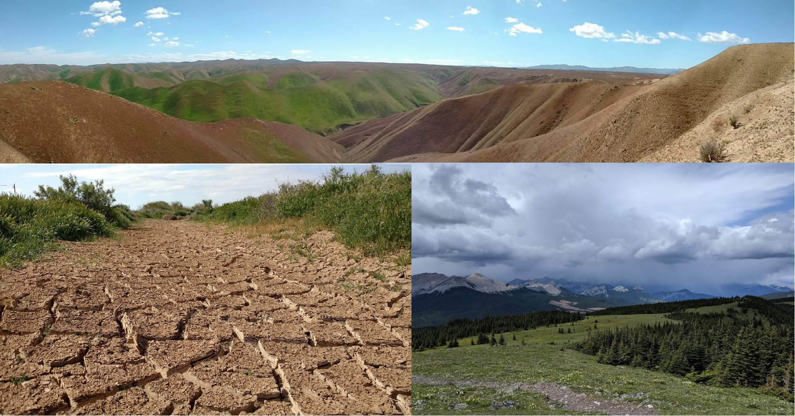

 

## General Information

Climate extremes, such as extended drought, heavy rainfall leading to flooding, and severe frost events, are predicted to increase in magnitude, duration, and frequency (IPCC 2014). Climate extremes affect ecosystems globally on an annual basis [(Du et al. 2018; ](https://www.sciencedirect.com/science/article/pii/S0048969718305047) [Zhang et al. 2013](https://agupubs.onlinelibrary.wiley.com/doi/full/10.1029/2012JG002136) and are expected to be more impactful driver of community assembly than gradual shifts in climate [(Jentsch, Kreyling & Beierkuhnlein 2007](https://esajournals.onlinelibrary.wiley.com/doi/full/10.1890/1540-9295%282007%295%5B365%3AANGOCE%5D2.0.CO%3B2)[; Smith 2011)](https://besjournals.onlinelibrary.wiley.com/doi/full/10.1111/j.1365-2745.2011.01833.x). Extreme climate events (ECE) are defined as a period where climate conditions surpass a threshold value from those previously observed (e.g. the 90th percentile) that elicit an extreme ecological response [(Smith 2011)](https://besjournals.onlinelibrary.wiley.com/doi/full/10.1111/j.1365-2745.2011.01833.x). However, not all climate extremes result in ECEs.Given the forecast of intensified climate extremes, there is a need to understand when extreme climate conditions result in extreme ecological responses and under which circumstances they do not, as ECE events should result in long-lasting impacts on ecosystems [(Smith 2011)](https://besjournals.onlinelibrary.wiley.com/doi/full/10.1111/j.1365-2745.2011.01833.x). Our ability to effectively predict the effects of climate change requires examining large-scale and long-term datasets to generate to tools necessary for improving our understanding of ECEs. 

**What**: The objective of the symposium is connect researchers examining extreme climate events and improve the ability of attendees to quantify/analyze extreme climate events in their respective area of research. The symposium will connect leading experts of extreme climate events in ecological research and include presentations of researchers currently exploring climate extremes. 

**Where**: York University, room TBD

## Schedule

Time   | Goal
-------|------------
08:30  | Arrival/Registration
09:15  | Invited talk by [Dr. Melinda Smith](https://wp.natsci.colostate.edu/smithlab/)
10:00 | Invited talk by [Dr. Kate Wilkins](https://kate-wilkins.weebly.com/)
10:45  | Coffee Break
11:00  | Submitted talks (15 min each)
12:30  | Lunch provided
01:30  | Submitted talks (15 min each)
02:45 | Coffee break
03:00 | Interactive session on testing ECEs
4:00  | Closing remarks
4:15 | End

