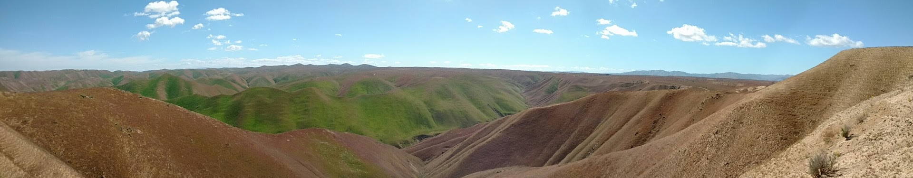

<div style="width:800px; height=350px">

</div>


 


   
</div>


[York University](https://www.yorku.ca/index.html) | 
----------------|-----------------------------------
October 8th, 2019   | **Instructor**: [Alex Filazzola](http://www.filazzola.info)
12:15 - 2:00 pm   | **306 Lumbers**

## General Information

Biologists cover a diverse set of disciplines (e.g. ecology, evolution, cell biology) and are thus expected to know a larger range of statistics. However, knowledge of the appropriate statistic test to answer a biological question can be a major limitation for researchers. This workshop is an introduction to the different methods and statistical approaches to analyzing data in all disciplines of biology. The workshop will focus on how to match the available data to possible analyses. I will discuss relevant analyses when there are multiple response variables, multiple predictors, and examples of presenting interactions (both statistical and biological). I will also discuss graphical representation of results and data manipulation. No prior knowledge is necessary, but some basic understanding of the R environment will make the workshop more relevant and useful. The goal of this workshop will be to provide a glossary of potential analyses that will assist understanding and presenting biological data.


**Who**: The course is aimed at R beginners to intermediate analysts. Some previous knowledge of R would be useful.

**Where**: York University, 306 Lumbers

**What else?**: If learning biostats isn't enough of a draw for you, we will be providing free food!!

**Requirements**: Participants should bring a laptop with a Mac, Linux, or Windows operating system (not a tablet, Chromebook, etc.) with administrative privileges. If you want to work along during tutorial, you must have R studio installed on your own computer (See below for instructions). However, if you prefer to watch, you are welcome to attend because all examples will be presented via a projector in the classroom. 

**Contact**: Please contact alex.filazzola@outlook.com for more information.

<div style="width:195px; text-align:center;" ><iframe  src="https://www.eventbrite.com/countdown-widget?eid=74498897207" frameborder="0" height="332" width="195" marginheight="0" marginwidth="0" scrolling="no" allowtransparency="true"></iframe><div style="font-family:Helvetica, Arial; font-size:12px; padding:10px 0 5px; margin:2px; width:195px; text-align:center;" ><a class="powered-by-eb" style="color: #ADB0B6; text-decoration: none;" target="_blank" href="http://www.eventbrite.com/">Powered by Eventbrite</a></div></div>

## Schedule

[Live Notepad](https://docs.google.com/document/d/1len4qcM-EkEMOl0NuNROyqlqMruqg4B4TZm4OS0NPoQ/edit)

Time   | Goal
-------|------------
12:15   | Meet & greet. Test software
12:30  | [Analysis Fundamentals](Analysis.Fundamental//Intro.html)
12:35 | [Univariate Stats](Univariate//index.html)
1:00 | [Multivariate analyses](Indices//ordinations.html)
1:30 | [Graphics](graphics//graphics.html)
1:55 | De-brief


## Software

#### R

[R](http://www.r-project.org/) is a programming language that is especially powerful for data exploration, visualization, and statistical analysis. To interact with R, we use [RStudio](http://www.rstudio.com/).


Windows        |   Mac OS  X   |      Linux
---------------|---------------|---------------
Install R by downloading and running [this .exe](http://cran.r-project.org/bin/windows/base/release.htm) file from [CRAN](http://cran.r-project.org/index.html). Please also install the [RStudio IDE](http://www.rstudio.com/ide/download/desktop).| Install R by downloading and running [this .pkg](http://cran.r-project.org/bin/macosx/R-latest.pkg) file from [CRAN](http://cran.r-project.org/index.html). Please also install the [RStudio IDE](http://www.rstudio.com/ide/download/desktop).|You can download the binary files for your distribution from [CRAN](http://cran.r-project.org/index.html). Please also install the [RStudio IDE](http://www.rstudio.com/ide/download/desktop)

#### Packages

Please install the `LearnCommAnalysis` package before attending. This package contains all the datasets, packages, and functions that will be used in the workshop. The package is available through Github and thus must be installed using `devtools` package. If you do not have `devtools`, please install that first before running the command below. There are multiple packages that are installed along-side this package. Therefore, the installation can take some time and could be prone to error. Please do this prior to attending to save time and troubleshoot errors. The most common error is that not all dependencies (i.e. packages that are dependent on other packages) were installed. Read the error message, and if this is an issue, install the package that is missing. 

```{r eval=FALSE}
library(devtools)
install_github("afilazzola/LearnCommAnalysis")

## Load package
library(LearnCommAnalysis)
```


## Other workshops

If you enjoyed this workshop and were interested in learning more, I also run a workshops on [R-basics and Introduction to Generalized Linear Modelling (GLM)](https://afilazzola.github.io/YorkU.GLM.2017-04-28/), [Using Github for Scientific Reproducibility](https://afilazzola.github.io/UoA.GithubWorkshop.2018/), and a short introduction on using [Functions in R](https://afilazzola.github.io/Functions.workshop.YorkU2017/). 

You can find similar style workshops, usually that are longer and go into more detail, with [Software Carpentry](https://software-carpentry.org/). They have teachers available globally and cover all forms of programming beyond R. 


