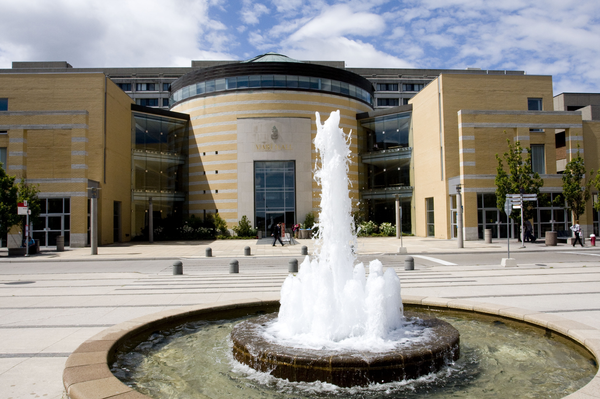

 

### Registration

Join ecologists from across North America to examine the role of extreme climate events play in effecting our natural systems.

 

### Costs

Registration is **FREE** for undergraduate students, graduate students, and anyone presenting a talk. For all other attendees registration is $50. Included in your registration is attendance to the entire symposium including invited talks, submitted talks, and the final interactive session. We are also including lunch, and two coffee breaks with snacks. Attendance will also be an opportuntiy to connect and collaborate with fellow researchers examining extreme climate in ecology. 

Please register before **February 12th, 2020 at 12:00 pm**. 

 

### Register today!

<iframe  src="https://www.eventbrite.com/countdown-widget?eid=88888282245" frameborder="0" height="332" width="195" marginheight="0" marginwidth="0" scrolling="no" allowtransparency="true"></iframe>
<a class="powered-by-eb" style="color: #ADB0B6; text-decoration: none;" target="_blank" href="http://www.eventbrite.com/">Powered by Eventbrite</a>

